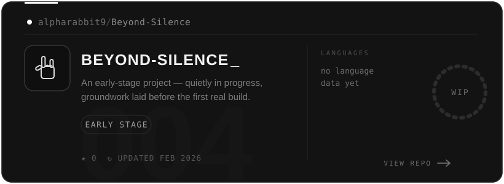

<!-- ══════════════════════════════════════════════════════════════════════
     RIFAT AHMED (@alpharabbit9) — GITHUB PROFILE README
     Monochrome editorial profile. Canvas: #0D0D0D · Cards: #131313
     Borders: #262626 · Text: #FFFFFF / #A3A3A3 / #737373
     Custom animated SVGs live in /assets and are generated to match the theme.
     ══════════════════════════════════════════════════════════════════════ -->

 

<!-- ══ HERO ── monochrome portrait banner (assets/hero.jpg) ══ -->

 
 

# R I F A T &nbsp; A H M E D

 

<samp>SYLHET, BANGLADESH &nbsp;·&nbsp; FINAL YEAR &nbsp;·&nbsp; COMPUTER SCIENCE & ENGINEERING</samp>

 
 

<!-- NAVIGATION -->
<samp>
<a href="#-statistics">STATS</a>
&nbsp;&nbsp;/&nbsp;&nbsp;
<a href="#-current-focus">FOCUS</a>
&nbsp;&nbsp;/&nbsp;&nbsp;
<a href="#-featured-projects">PROJECTS</a>
&nbsp;&nbsp;/&nbsp;&nbsp;
<a href="#-activity">ACTIVITY</a>
&nbsp;&nbsp;/&nbsp;&nbsp;
<a href="#-connect">CONNECT</a>
</samp>

 
 

<!-- VISITOR COUNTER -->

&nbsp;

 

<!-- ══════════════════════ STATISTICS ══════════════════════ -->

## ⌘ STATISTICS

 

<!-- Self-contained monochrome dashboard (assets/stats.svg) — animated headline
     figures, GitHub-stats card and a Most-Used-Languages bar. No external
     stat service, so it never renders as a broken image. Regenerate with the
     build script to refresh the numbers. -->

 

<!-- ══════════════════════ CURRENT FOCUS ══════════════════════ -->

## ⌘ CURRENT FOCUS

<!-- Animated monochrome SVG — status dots, drawing underlines, sweeping sheen -->

<!-- ══════════════════════ FEATURED PROJECTS ══════════════════════ -->

## ⌘ FEATURED PROJECTS

<!-- Every card is CLICKABLE → its repository. Animated SVG, monochrome theme. -->

 

 

 

 
 

<samp>
<a href="https://github.com/alpharabbit9/Rabbitverse">001 RABBITVERSE</a> &nbsp;·&nbsp;
<a href="https://github.com/alpharabbit9/AI-Powered-Real-Estate-Lead-Qualification-Appointment-Booking-System">002 REAL-ESTATE LEAD AI</a> &nbsp;·&nbsp;
<a href="https://github.com/alpharabbit9/Health-AI">003 HEALTH-AI</a> &nbsp;·&nbsp;
<a href="https://github.com/alpharabbit9/Beyond-Silence">004 BEYOND-SILENCE</a> &nbsp;·&nbsp;
<a href="https://github.com/alpharabbit9/AI-instant-Lead-Response-System">005 INSTANT LEAD RESPONSE</a> &nbsp;
<a href="https://ai-instant-lead-response-system.vercel.app">↗ LIVE</a> &nbsp;·&nbsp;
<a href="https://github.com/alpharabbit9/Ai-Resume-builder-client">006 AI RESUME BUILDER</a>
</samp>

<!-- ══════════════════════ ACTIVITY ══════════════════════ -->

## ⌘ ACTIVITY

 

 
 

<!-- SNAKE ANIMATION ─ generated by .github/workflows/snake.yml (Platane/snk).
     Monochrome palette, swaps with GitHub light/dark mode automatically. -->
<picture>
  <source media="(prefers-color-scheme: dark)" srcset="https://raw.githubusercontent.com/alpharabbit9/alpharabbit9/output/github-contribution-grid-snake-dark.svg" />
  
</picture>

 

<!-- ══════════════════════ CONNECT ══════════════════════ -->

## ⌘ CONNECT

 

<!-- Replace each href with your real profile URLs -->

&nbsp;

&nbsp;

&nbsp;

&nbsp;

 
 

<samp>OPEN TO — INTERNSHIPS · FREELANCE · OPEN SOURCE COLLABORATION</samp>

 

 

 

<!-- ══════════════════════ FOOTER ══════════════════════ -->

<samp>"SIMPLICITY IS THE FINAL ACHIEVEMENT."</samp>

— FRÉDÉRIC CHOPIN

 
 

 
 

<samp>DESIGNED WITH INTENTION · BUILT WITH GITHUB MARKDOWN</samp>

 
 

